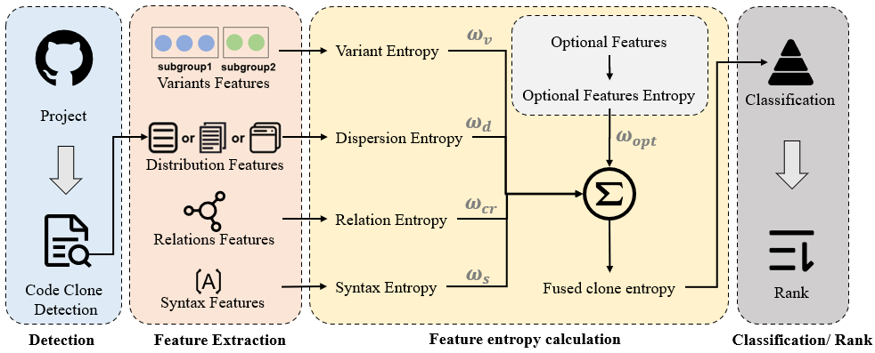

# CloneCloneClassification
Code Clone Classification based on Multi-Dimension Feature Entropy
## Introduction
Managing code clones remains a critical challenge in software engineering despite advanced detection techniques. While refactoring typically eliminates clones, complex groups with variants across locations complicate this process. Our research analyzes large-scale datasets from three domains, revealing consistent clone metric distributions while demonstrating these alone can't assess refactoring complexity. We introduce a novel entropy-based classification system using four feature entropies—variant, distribution, relation, and syntactic—combined into a fused entropy metric. This approach effectively ranks clone groups by refactorability, helping developers prioritize manageable clones. Validated across multiple domains, our method proves feature entropies significantly identify refactor-friendly clones, with manual analysis confirming complexity isn't solely instance-dependent. This provides new pathways for clone management and future maintenance research.
<div align="center">
  
</div>

## Install and Execute
### Obtain Project
```
git clone https://github.com/nikoHu/CloneCloneClassification.git
```
### Obtain method information
Use a clone detection tool to detect code information and clone information, and group the clone instances to obtain the following file:
<div align="center">
  
</div>
The file MeasureIndex.csv stores function index information, with the fields (ID, Path, Start Line, End Line) in order.
The file type123_method_group_result.csv stores clone group information, where each row represents one group.
Save the above files to the result folder. Modify the cloneResultPath in CloneClassification.properties to the dataset path.

### Generate Entropy
```
java -jar clone-0.0.1-SNAPSHOT.jar
```
The result is saved in result/cloneComplexFeature.csv.

